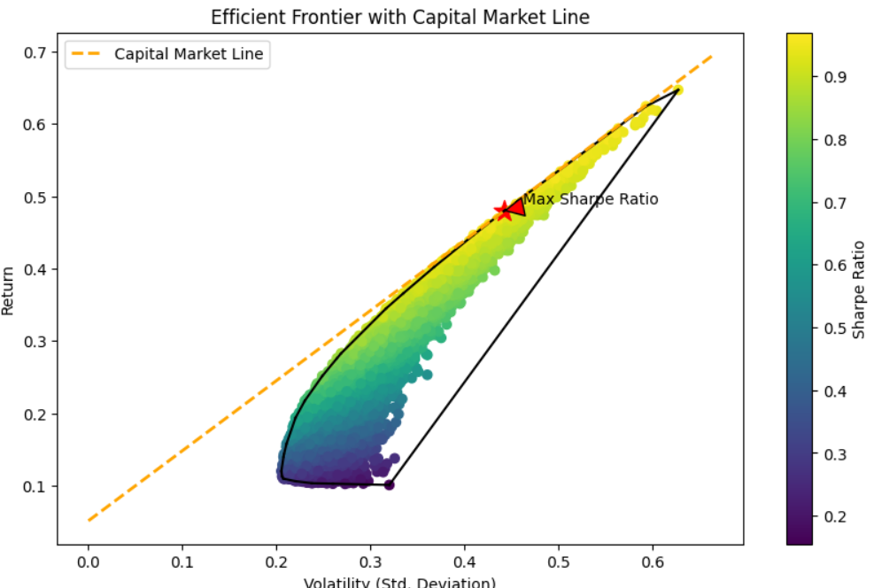

# Portfolio Optimization and Efficient Frontier Visualization

This project provides a Python-based implementation for simulating multiple portfolios, visualizing the efficient frontier, and plotting the Capital Market Line (CML). The code demonstrates how to optimize portfolios by finding the one with the maximum Sharpe ratio, which is where the CML tangentially touches the efficient frontier.

## Features
- **Portfolio Simulation**: Generates multiple portfolios with random weights.
- **Efficient Frontier Visualization**: Plots the expected returns against the volatility of portfolios.
- **Capital Market Line (CML)**: Displays the CML, showing the relationship between risk (volatility) and return, starting from a risk-free rate.
- **Tangency Point Identification**: Highlights the optimal portfolio with the highest Sharpe ratio.

## Ratios Explained

### Sharpe Ratio
The Sharpe Ratio measures the performance of an investment compared to a risk-free asset, after adjusting for its risk. It is calculated as:
```
Sharpe Ratio = (Rp - Rf) / σp
```
Where:
- `Rp` = Expected portfolio return
- `Rf` = Risk-free rate
- `σp` = Standard deviation of portfolio returns (volatility)

### Sortino Ratio
The Sortino Ratio is a variation of the Sharpe Ratio that differentiates harmful volatility from total overall volatility by using the standard deviation of negative asset returns (downside deviation) instead of the total standard deviation of asset returns. It is calculated as:
```
Sortino Ratio = (Rp - Rf) / Downside Deviation
```
Where:
- `Downside Deviation` considers only the returns that fall below a defined minimum acceptable return.

### Treynor Ratio
The Treynor Ratio, also known as the reward-to-volatility ratio, measures returns earned in excess of that which could have been earned on a riskless investment per each unit of market risk. It is calculated as:
```
Treynor Ratio = (Rp - Rf) / βp
```
Where:
- `βp` = Beta of the portfolio, a measure of its sensitivity to market movements.

## How to Run
1. **Clone the Repository**
   ```sh
   git clone https://github.com/ayushbaghel01/portfolio-optimization.git
   cd portfolio-optimization
   ```

2. **Install Dependencies**
   ```sh
   pip install -r requirements.txt
   ```

3. **Run the Script**
   ```sh
   python portfolio_optimization.py
   ```

## Dependencies
- `numpy`
- `pandas`
- `matplotlib`
- `yfinance`
- `scipy`


